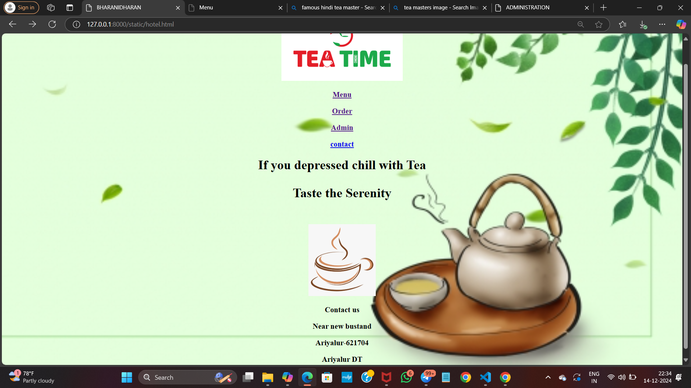
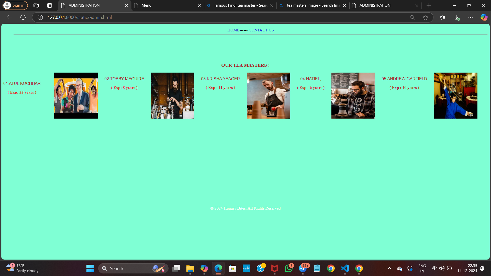
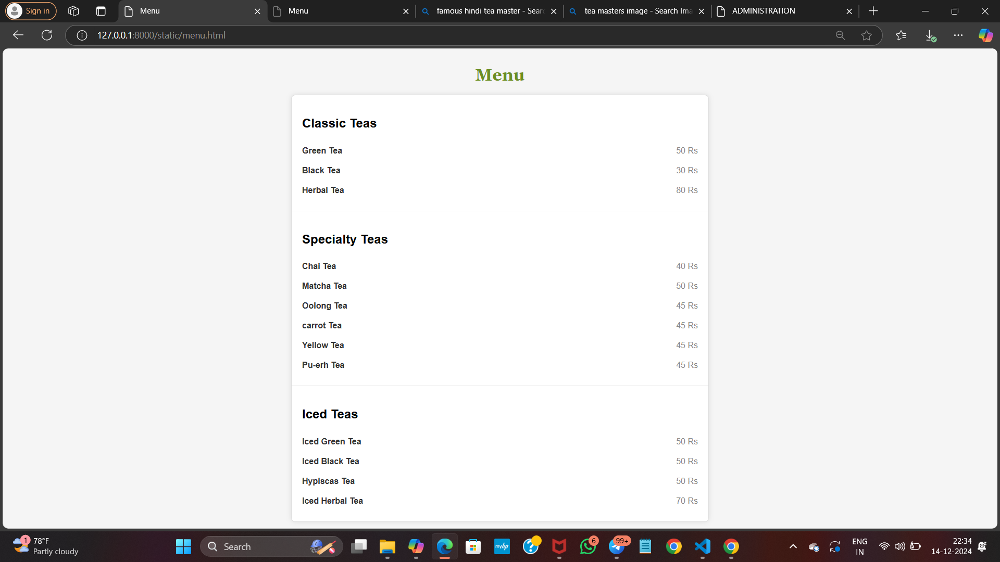
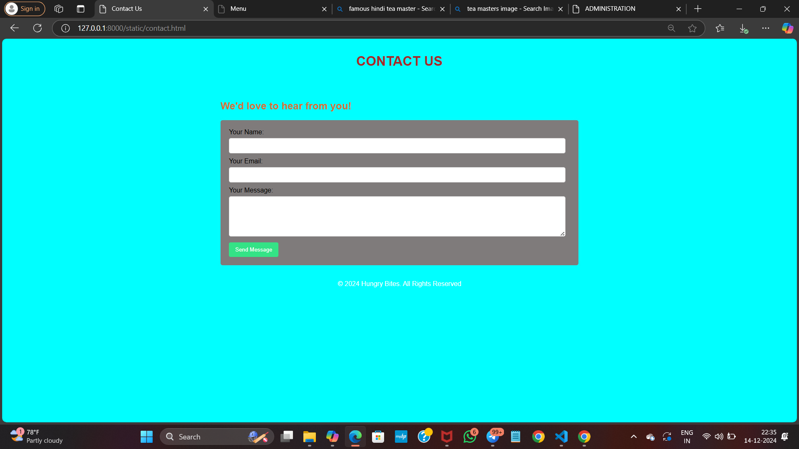

# Ex.07 Restaurant Website
# Date:27/11/2024
# AIM:
To develop a static Restaurant website to display the food items and services provided by them.

# DESIGN STEPS:
## Step 1:
Requirement collection.

## Step 2:
Creating the layout using HTML and CSS.

## Step 3:
Updating the sample content.

## Step 4:
Choose the appropriate style and color scheme.

## Step 5:
Validate the layout in various browsers.

## Step 6:
Validate the HTML code.

## Step 7:
Publish the website in the given URL.

# PROGRAM:
Home page:
```
<!DOCTYPE html>
<html>
    <head>
        <title>BHARANIDHARAN </title>
        <body>
            <div>
                <style>
                    body{
                        background-image: url(https://png.pngtree.com/thumb_back/fh260/back_our/20190620/ourmid/pngtree-simple-green-fresh-tea-tea-shop-home-background-image_161078.jpg);
              background-size: cover;
              background-position: 100%;
              background-repeat: no-repeat;
              
                    }
                </style>
            </div>
           
          <center> <br>
          <a href="menu.html"><h3>Menu</h3></a>
          <a href="https://teatimegroup.com/"><h3>Order</h3></a>
          <a href="admin.html"><h3>Admin</h3></a>
          <a href="contact.html"><h3>contact</h3></a>
          <p><h1>If you depressed chill with Tea</p><h1>
            <p><h1>Taste the Serenity </h1></p>
            <br>
            <br>
            <div>
                      
             </div>
           
        
             <h3>Contact us</h3>
            <h3>Near new bustand</h3>
            <h3>Ariyalur-621704</h3> 
            <h3>Ariyalur DT</h3>
        </body>

    </head>
</html>
```
Menu page:
```
<!DOCTYPE html>
<html lang="en">
<head>
  <meta charset="UTF-8">
  <meta name="viewport" content="width=device-width, initial-scale=1.0">
  <title>Menu</title>
  <style>
    body {
      font-family: 'Arial', sans-serif;
      background-color: #f5f5f5;
      margin: 0;
      padding: 0;
      display: flex;
      flex-direction: column;
      align-items: center;
      justify-content: center;
      min-height: 100vh;
    }

    h1 {
      font-family: 'Georgia', serif;
      color: #6b8e23;
      margin: 20px 0;
    }

    .menu {
      width: 80%;
      max-width: 800px;
      border: 1px solid #ddd;
      border-radius: 8px;
      background-color: #fff;
      box-shadow: 0 0 10px rgba(0, 0, 0, 0.1);
    }

    .menu-section {
      padding: 20px;
      border-bottom: 1px solid #ddd;
    }

    .menu-section:last-child {
      border-bottom: none;
    }

    .menu-item {
      display: flex;
      justify-content: space-between;
      padding: 10px 0;
    }

    .menu-item-name {
      font-weight: bold;
      color: #333;
    }

    .menu-item-price {
      color: #888;
    }
  </style>
</head>
<body>
  <h1>Menu</h1>
  <div class="menu">
    <div class="menu-section">
      <h2>Classic Teas</h2>
      <div class="menu-item">
        <span class="menu-item-name">Green Tea</span>
        <span class="menu-item-price">50 Rs</span>
      </div>
      <div class="menu-item">
        <span class="menu-item-name">Black Tea</span>
        <span class="menu-item-price">30 Rs</span>
      </div>
      <div class="menu-item">
        <span class="menu-item-name">Herbal Tea</span>
        <span class="menu-item-price">80 Rs</span>
      </div>
    </div>
    <div class="menu-section">
      <h2>Specialty Teas</h2>
      <div class="menu-item">
        <span class="menu-item-name">Chai Tea</span>
        <span class="menu-item-price">40 Rs</span>
      </div>
      <div class="menu-item">
        <span class="menu-item-name">Matcha Tea</span>
        <span class="menu-item-price">50 Rs</span>
      </div>
      <div class="menu-item">
        <span class="menu-item-name">Oolong Tea</span>
        <span class="menu-item-price">45 Rs</span>
      </div>
      <div class="menu-item">
        <span class="menu-item-name">carrot Tea</span>
        <span class="menu-item-price">45 Rs</span>
      </div>
      <div class="menu-item">
        <span class="menu-item-name"> Yellow Tea</span>
        <span class="menu-item-price">45 Rs</span>
      </div>
      <div class="menu-item">
        <span class="menu-item-name">Pu-erh Tea</span>
        <span class="menu-item-price">45 Rs</span>
      </div>
    </div>
    <div class="menu-section">
      <h2>Iced Teas</h2>
      <div class="menu-item">
        <span class="menu-item-name">Iced Green Tea</span>
        <span class="menu-item-price">50 Rs</span>
      </div>
      <div class="menu-item">
        <span class="menu-item-name">Iced Black Tea</span>
        <span class="menu-item-price">50 Rs</span>
      </div>
      <div class="menu-item">
        <span class="menu-item-name">Hypiscas Tea</span>
        <span class="menu-item-price">50 Rs</span>
      </div>
      <div class="menu-item">
        <span class="menu-item-name">Iced Herbal Tea</span>
        <span class="menu-item-price">70 Rs</span>
      </div>
    </div>
  </div>
</body>
</html>

```
Admin page:
```
<!DOCTYPE html>
<html>
    <head>
        <title>ADMINISTRATION</title>
        <style>
             body{
                background-size: 1550px;

                background-repeat: no-repeat;
                background-color: aquamarine;

            }.image-row {
                    display: flex;
                    gap: 1.4%;
                }
                .image-row img{
                    width: 170PX;
                    height: 180PX;

                }
                footer {
                    
                     color: white;
                     padding: 2px;
                     text-align: center;
                }
        </style>
            </head>
            <center>
                <body>
                    <nav>
                        <ul>
                            <a href="hotel.html" style="color: rgb(41, 47, 205); size: 10px;" >HOME</a>------
                            <a href="contact.html" style="color: rgb(31, 34, 226);">CONTACT US</a><hr>
                            
                        </ul>
                    </nav>
                   <br><br><br><br>
                    <h3 style="color: brown;"> OUR TEA MASTERS :</h3>
        <style>
            
        </style>
        
        <div  class="image-row">
            <div>
                <br><p style="color: brown; font-family: Arial, Helvetica, sans-serif;" >01.ATUL KOCHHAR</p>
               
                <b style="color: rgb(234, 36, 36);"> ( Exp: 22 years )</b>
            </div>
            <BR>
                
                <div>
                    <p style="color: brown; font-family: Arial, Helvetica, sans-serif;">02.TOBBY MEGUIRE</p>
                    
                    <b style="color: rgb(225, 53, 53);"> ( Exp: 8 years )</b>
                </div>
                

                <div>
                    <p style="color: brown; font-family: Arial, Helvetica, sans-serif;">03.KRISHA YEAGER</p>
                    
                    <b style="color:rgb(215, 38, 38);"> ( Exp : 11 years )</b>
                </div>
                

                <div>
                    <p style="color: brown; font-family: Arial, Helvetica, sans-serif;">04.NATIEL;</p>
                    
                    <b style="color: rgb(201, 51, 51);"> ( Exp : 6 years )</b>
                </div>
                

                <div>
                    <p style="color: brown; font-family: Arial, Helvetica, sans-serif;">05.ANDREW GARFIELD</p>
                    
                    <b style="color: rgb(176, 42, 42);"> ( Exp : 10 years )</b>
                </div>
                
               
            </div>
            <br>
            <br>
            <br>
        </center><br><br><br><br><br><br><br><br><br><br><br><br><br><br><br>
        <footer>
            <p>&copy; 2024 Hungry Bites. All Rights Reserved</p>
        </footer>
    </body>
</html>

```
Contact page:
```
<!DOCTYPE html>
<html>
<head>
    <title> Contact Us </title>
    <style>
        body {
            font-family: Arial, sans-serif;
            margin: 0;
            padding: 0;
            background-color: aqua;
            
            
        }
        header {

            color: white;
            padding: 15px 0;
            text-align: center;
        }
        .container {
            width: 45%;
            margin: 0 auto;
            padding: 18px;
        }
        form {
            background-color: #7f7b7b;
            padding: 20px;
            border-radius: 5px;
            box-shadow: 0 0 8px rgba(192, 183, 183, 0.1);
        }
        label {
            display: block;
            margin-bottom: 5px;
        }
        input, textarea {
            width: 96%;
            padding: 10px;
            margin-bottom: 10px;
            border-radius: 5px;
            border: 1px solid #ccc;
        }
        button {
            background-color: #34e386;
            color: white;
            padding: 10px 15px;
            border: none;
            border-radius: 4px;
            cursor: pointer;
        }
        button:hover {
            background-color: brown;
        }
        footer {
                     
                     color: white;
                     padding: 2px;
                     text-align: center;
        }
    </style>
</head>
<body>

<header>
    <h1 style="color: brown;">CONTACT US</h1>
</header>

<div class="container">
    <h2 style="color: rgb(213, 112, 53);">We'd love to hear from you!</h2>
    <form action="#" method="POST">
        <label for="name">Your Name:</label>
        <input type="text" id="name" name="name" required>

        <label for="email">Your Email:</label>
        <input type="email" id="email" name="email" required>

        <label for="message">Your Message:</label>
        <textarea id="message" name="message" rows="5" required></textarea>

        <button type="submit">Send Message</button>
    </form>
</div>
<footer>
    <p>&copy; 2024 Hungry Bites. All Rights Reserved</p>
</footer>
</body>
</html>

```

# OUTPUT:

#Home page:


#Admin page:


#Menu page:


#contact page:



# RESULT:
The program for designing software company website using HTML and CSS is completed successfully.
